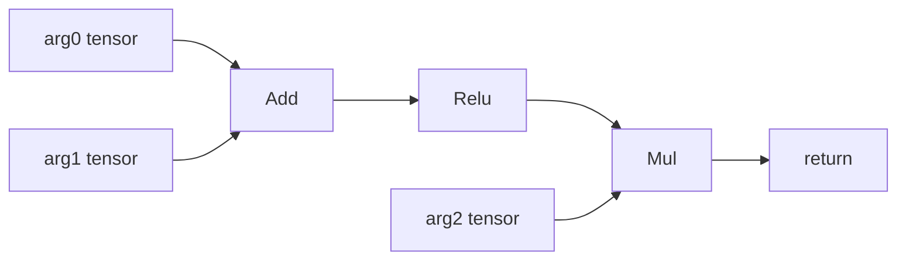
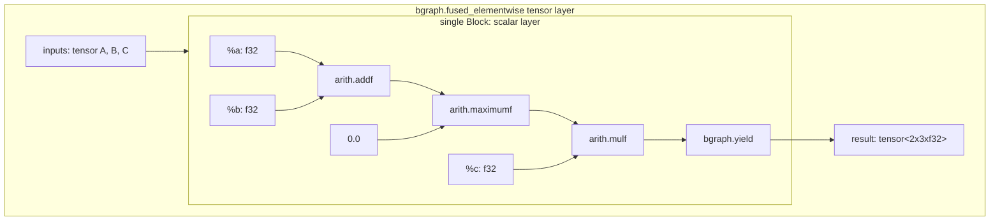

# 09｜Region、use-def 与 elementwise fusion

## 1. 本章目标

你将能画出真实 Add→Relu→Mul 的 use-def 图和 fused Region，解释 tensor operands
如何映射到 scalar block arguments，并判断单用户、分支和静态广播下的融合结果。

## 2. 先运行

```bash
cd /buddy-mlir/jlq/projects/buddygraph
export BUDDYGRAPH_TMP=/buddy-mlir/jlq/projects/buddygraph/tmp
mkdir -p "$BUDDYGRAPH_TMP"
build/bin/buddygraph-opt --bgraph-fuse-elementwise \
  tests/Dialect/BGraph/fuse-elementwise.mlir \
  -o "$BUDDYGRAPH_TMP/fuse-elementwise.after.mlir"
sed -n '1,140p' "$BUDDYGRAPH_TMP/fuse-elementwise.after.mlir"
```

`@fuse` 中 Add/Relu/Mul 变成一个 FusedElementwise；`@do_not_duplicate` 的共享 Add
仍存在。实现可能合法地融合其下游 Relu→Mul 子链，但不会把多用户 Add 克隆进 Region。

## 3. 真实代码位置

- `FuseElementwise.cpp::isFusible()`。
- `ElementwiseTree::{operations, orderedOperations, leaves, collect()}`。
- `emitScalar()`。
- `FuseElementwisePattern<RootOp>::matchAndRewrite()`。
- `BGraphFuseElementwise::runOnOperation()`。
- `BGraphOps.cpp::FusedElementwiseOp::verify()`、`YieldOp::verify()`。
- `BGraphToLinalg.cpp::FusedElementwiseLowering`。
- `tests/Dialect/BGraph/fuse-elementwise.mlir`。

## 4. 调用链

```text
applyPatternsGreedily(top-down)
→ 对 Add/Sub/Mul/Div/Relu root 尝试 FuseElementwisePattern
→ 若 root 还有 fusible user：不是 chain root，failure
→ ElementwiseTree::collect(root)
   → producer fusible 且当前 operand.hasOneUse()：递归收集
   → 否则加入 ordered leaves
→ 至少两个 ops 才继续
→ create FusedElementwiseOp + Region + Block
→ 每个 tensor leaf 建一个 scalar BlockArgument
→ IRMapping: leaf Value ↦ BlockArgument
→ emitScalar(root) 递归创建 arith scalar ops
→ create YieldOp
→ replace root，删除已无 uses 的旧 ops
```

随后 lowering：

```text
FusedElementwiseLowering::matchAndRewrite()
→ createElementwiseGeneric()
→ broadcastMap() 为每个 tensor input 建 indexing map
→ linalg.generic body builder
→ IRMapping: source BlockArgument ↦ linalg body argument
→ builder.clone(source scalar ops, mapping)
→ source Yield value ↦ linalg.yield
```

## 5. IR 前后变化

use-def 图：



Region 结构：



Region 表达“对每个输出 index 执行的 scalar formula”；外层 tensor operands/result
表达 shape 和广播。`bgraph.yield` 不是函数 return，只结束 fused body。

## 6. 核心机制

`hasOneUse()` 防止把共享 producer 克隆进 Region。对于多用户 Add，collect 把它作为
leaf，所以可以继续融合 Add 之后的单用户子链，但 Add 自身保留并只计算一次。

`llvm::SetVector<Value> leaves` 同时去重和保持确定顺序；该顺序必须与 block arguments
一一对应。`SmallPtrSet` 防止重复收集同一 Operation。

fusion pass 中的 `IRMapping` 只映射 tensor leaves 到 scalar args；scalar body由
`emitScalar()` 显式重建，不是 clone 原 BGraph tensor ops。真正的 `builder.clone()`
发生在 fused-to-Linalg lowering，把 Region 中已是 scalar 的 arith ops 克隆到
`linalg.generic` body。

当前实现支持静态 NumPy 风格广播。`broadcastMap()` 对输入维为 1、输出对应维不为 1
时使用 affine constant 0；其他维映射到输出 loop dimension。所有 input/result 必须
静态，否则 lowering 返回 failure。

## 7. 为什么这样设计

Region 让 fused op 保存任意白名单 scalar expression，而不需要为每一种链新增一个
Op。外层保持 tensor contract，内层可以直接成为 `linalg.generic` body。single-use
边界避免重复计算；static broadcast maps 让支持范围有明确 lowering 证据。

## 8. 常见错误

- 从链中间开始融合，留下重叠 fused candidates；代码先检查 fusible user。
- 多用户 producer 仍递归 collect，导致复制计算或删除有用户 op。
- block argument 数/顺序与 leaves 不一致。
- 忘记 `InsertionGuard`，scalar ops 插入父 Block。
- Region 含 `arith.negf` 等白名单外 op，parent verifier 拒绝。
- yield 类型不是 result element type。
- 宣称支持 dynamic broadcast；lowering 明确要求 static shape。

## 9. 动手练习

先不运行，预测下图的 leaves 和被融合 ops：`a,b → add`，add 同时被 `relu` 和
`return side` 使用，`relu,c → mul → return main`。再对照 `@do_not_duplicate` 输出。

修改题：在项目 `tmp/` 测试副本中给 `@fuse` 的 `%1` 增加一个额外 return-use（可用
另一个 Add 汇合），观察 collect 边界和 fused body inputs 如何变化。

## 10. 验收标准

- 能从 IR 画出 use-def 图并正确标出 single/multiple use。
- 能解释两个阶段各自如何使用 `IRMapping`。
- `@fuse` 只生成一个 fused op，FullConversion 后只生成一个相关 generic。
- 能解释 static broadcast 的 affine constant-0 map。

## 11. 面试追问

**问：为什么 fused op 需要 Region？**

答：链的 scalar formula 随 graph 而变；Region 能把 operands 映射成 block arguments，
保存实际 arith expression 和 yield，同时外层只暴露稳定的 tensor contract。

**问：多用户为何不能直接融合？**

答：把 shared producer 克隆进 fused Region 会重复计算；删除它又会破坏另一个用户。
当前实现把它作为 fused leaf，最多融合其下游单用户链。
